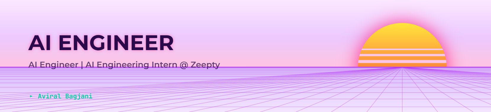
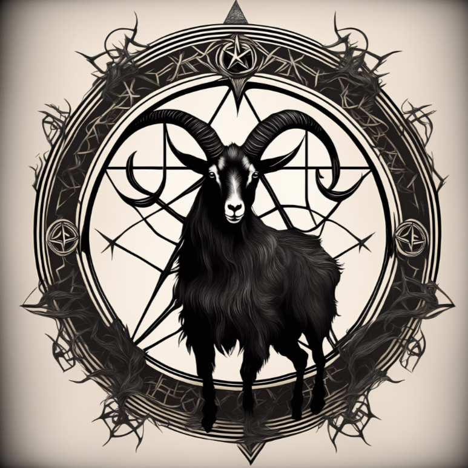
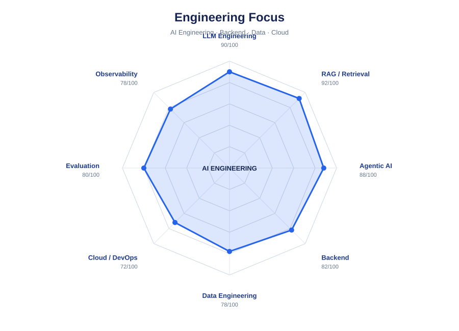
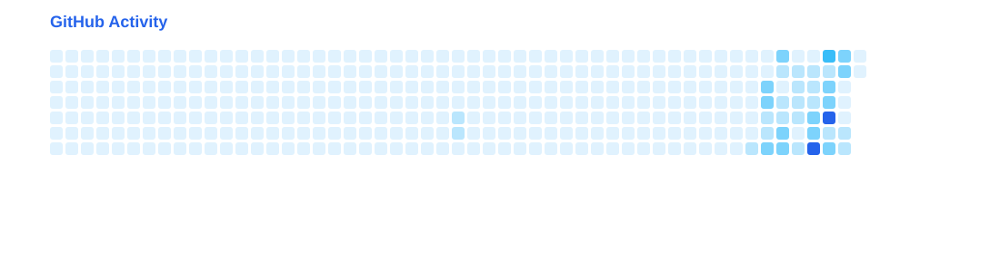

<!--
  GitHub Profile README
  Replace only the placeholders marked with [YOUR_*].
-->

  <!-- Responsive Light/Dark Banner -->
  <picture>
    <source media="(prefers-color-scheme: dark)" srcset="header-dark.png">
    <source media="(prefers-color-scheme: light)" srcset="header-light.png">
    
  </picture>

    

  # Hey there, I'm Aviral Bagjani 👋

  

    

  
  
  

 

## 👨‍💻 About Me

<table>
<tr>
<td width="65%" valign="top">

I'm **Aviral Bagjani**, an aspiring **AI Engineer** focused on building practical, production-oriented AI systems.

- 🎓 **B.Tech ECE '26 @ IIIT Bhagalpur**
- 💼 **AI Engineering Intern @ Zeepty**
- 🤖 Focused on **LLM applications, RAG systems, Agentic AI, and multi-agent systems**
- 🏗️ Interested in **production AI engineering**
- 🚀 Building systems around retrieval, agents, LLM infrastructure, guardrails, evaluation, and observability
- 🎯 Seeking **Fresher AI Engineer roles**

My work focuses on turning LLM capabilities into structured, reliable, and production-oriented AI applications.

</td>

<td width="35%" align="center" valign="middle">

</td>
</tr>
</table>

 

## 🧠 Core Focus

`LLM Applications` &nbsp; `RAG Systems` &nbsp; `Agentic AI` &nbsp; `Multi-Agent Systems` &nbsp; `Production AI Engineering`

 

## 🛠️ Tech Stack

### 🤖 AI Engineering

  

`LLM Applications` · `RAG` · `Agentic AI` · `Multi-Agent Systems`  
`Prompt Engineering` · `Guardrails` · `Evaluation` · `Observability`

  

### ⚙️ Backend & Data

  

### ☁️ Cloud & Engineering

  

### 🧩 AI Infrastructure

`FastAPI` · `Qdrant` · `PostgreSQL` · `Redis` · `LangSmith`  
`LLM Gateways` · `Hybrid Retrieval` · `Memory` · `CI/CD`

 

## 🧠 Engineering Focus

 

**AI Engineering:** LLM Gateways · Guardrails · Evaluation · LangSmith

 

## 🚀 Featured Projects

<table>
<tr>
<td width="50%" valign="top">

### RAGFury

**Production-oriented agentic knowledge retrieval / RAG system**

A focused project around building production-oriented retrieval and RAG capabilities for knowledge-intensive AI applications.

**Focus:**  
RAG · Retrieval · Agentic AI · Production AI Engineering

</td>

<td width="50%" valign="top">

### AgentFlow

**Agentic research/content automation platform**

A platform focused on using agentic workflows for research and content automation.

**Focus:**  
Agentic AI · Multi-Agent Systems · LLM Applications · Automation

</td>
</tr>
</table>

 

## 📊 GitHub Activity

  

 

## 🐍 Contribution Snake

<picture>
  <source
    media="(prefers-color-scheme: dark)"
    srcset="https://raw.githubusercontent.com/aviral-dot/aviral-dot/gh-pages/github-contribution-grid-snake-dark.svg"
  >
  <source
    media="(prefers-color-scheme: light)"
    srcset="https://raw.githubusercontent.com/aviral-dot/aviral-dot/gh-pages/github-contribution-grid-snake.svg"
  >
  
</picture>

## 🤝 Connect With Me

  

### Building AI systems from ideas to production.

 

